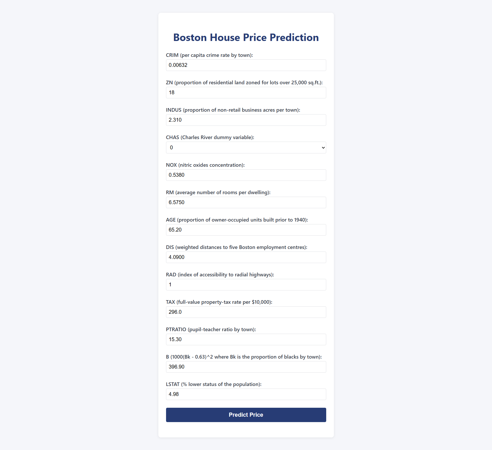
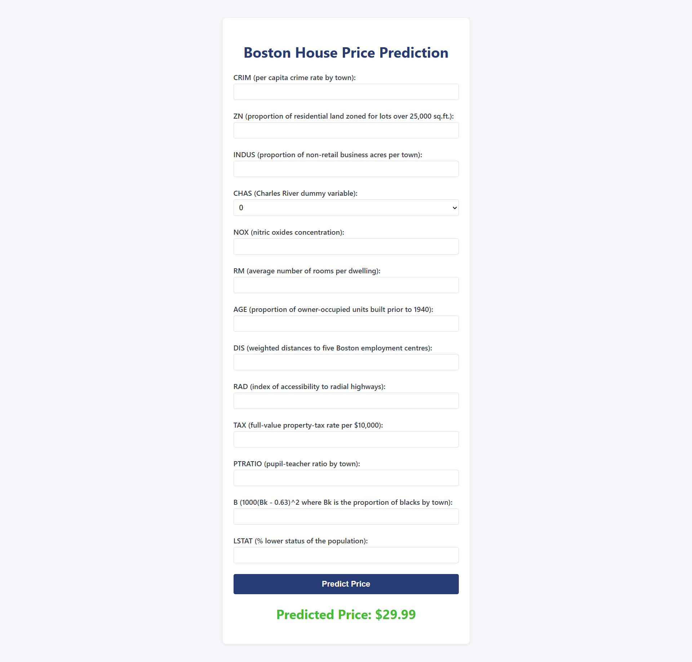

# Boston House Price Prediction

## Software and Tools Required

1. [Github Account](https://github.com)
2. [Heroku Account](https://heroku.com)
3. [VS Code IDE](https://code.visualstudio.com)
4. [Git CLI](https://git-scm.com)

## Project Overview

This project uses linear regression algorithm to predict house prices based on various features from the Boston housing dataset. It includes data preprocessing, exploratory data analysis, model training, evaluation, and deployment instructions.

## Setup Instructions

1. Clone the repository:
	```bash
	git clone https://github.com/iamjunaidjutt/boston_house_pricing.git
	```
2. Navigate to the project directory:
	```bash
	cd boston_house_pricing
	```
3. Create a new Python environment (recommended):
	 - Using venv (standard Python):
		 ```bash
		 python -m venv venv
		 source venv/bin/activate  # On Windows use: venv\Scripts\activate
		 ```
	 - Or using conda:
		 ```bash
		 conda create -n boston_env python=3.10
		 conda activate boston_env
		 ```
4. Install required Python packages:
	 ```bash
	 pip install -r requirements.txt
	 ```

## Usage


### Jupyter Notebook
1. Run the Jupyter notebook to explore the analysis and model training steps:
	```bash
	jupyter notebook
	```

### Flask Web App
2. To use the Flask web app for predictions:
	```bash
	python app.py
	```
   - Open your browser and go to `http://127.0.0.1:5000/`.
   - Fill in the form with the required features and submit to get the predicted house price.
   - If you encounter errors, ensure all fields are filled and valid.

## Screenshots


#### Home Page


#### Prediction Result


## Deployment


You can deploy the Flask API to Heroku or other cloud platforms. See the `Procfile` and deployment instructions in the repository for details.

**Project Completion:**
- All components (Jupyter notebook, Flask backend, HTML form, CSS styling, and screenshots) are included and validated.
- The Flask backend robustly handles user input and provides clear error feedback.
- Screenshots demonstrate the home page and prediction result for documentation.

**Further Steps:**
- For advanced usage, consider containerizing the app with Docker or integrating with cloud ML services.
- For frontend improvements, build a Next.js or React interface and connect it to the Flask API.

## Contributing

Pull requests are welcome. For major changes, please open an issue first to discuss what you would like to change.

## License

This project is licensed under the Apache License 2.0.

## Contact

For questions or feedback, contact [iamjunaidjutt](https://github.com/iamjunaidjutt).